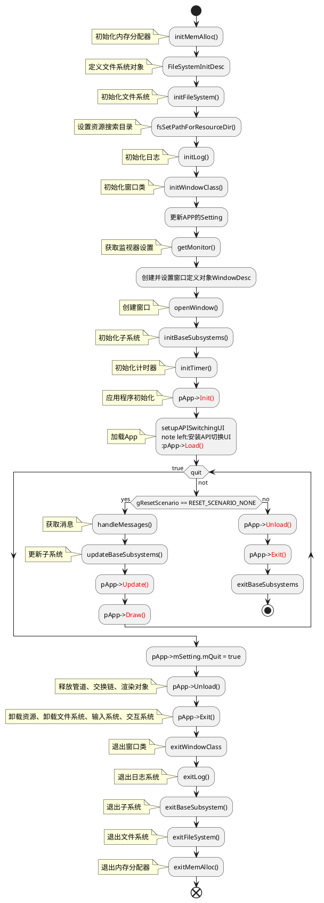
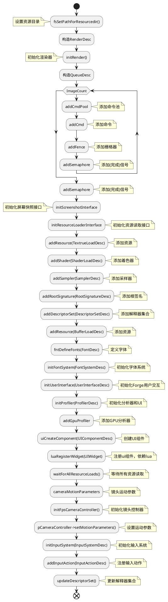
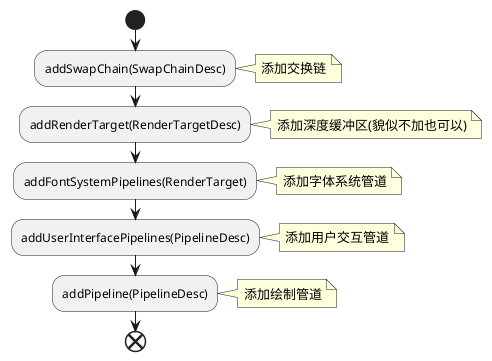
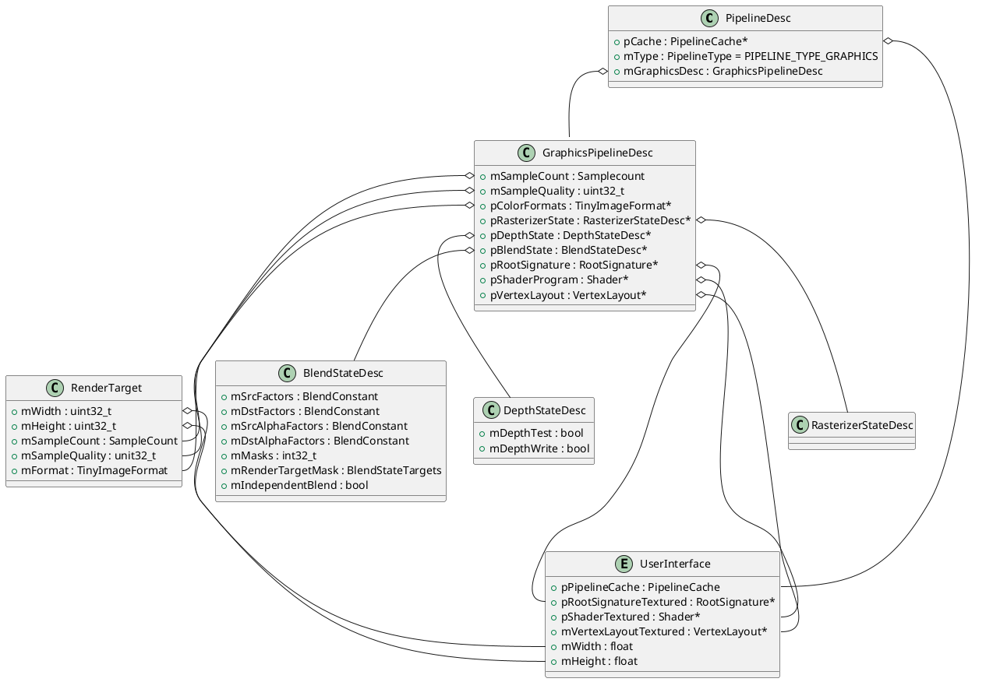
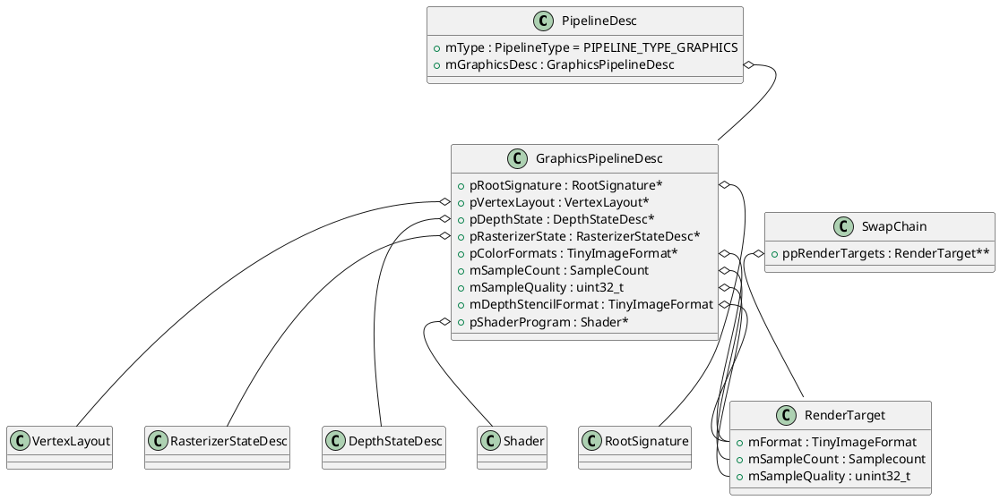
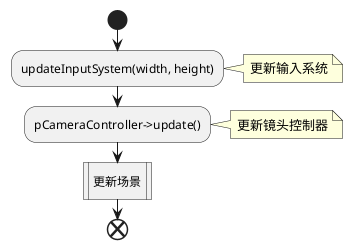
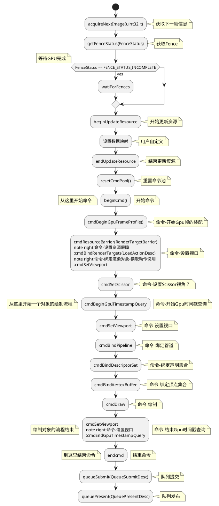
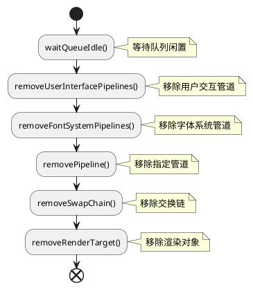
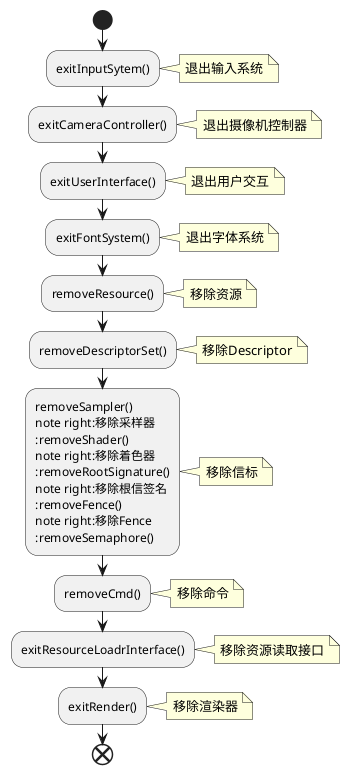

# 独立程序

床啊及独立程序需要执行以下步骤：

1. 从`IApp`接口类派生自定义应用类。`IApp`类定义了程序主入口、创建窗体、初始化绘制信息、更新信息、退出等接口。

2. 使用`DEFINE_APPLICATION_MAIN`宏注册自定义应用类。
   
   ```cpp
   #define DEFINE_APPLICATION_MAIN(appClass)                         \
       int IApp::argc;                                               \
       const char** IApp::argv;                                      \
       extern int WindowsMain(int argc, char** argv, IApp* app);     \
                                                                     \
       int main(int argc, char** argv)                               \
       {                                                             \
           IApp::argc = argc;                                        \
           IApp::argv = (const char**)argv;                          \
           appClass app;                                             \
           return WindowsMain(argc, argv, &app);                     \
       }
   ```
   
   其中`WindowsMain`执行流程：



# IApp的接口

## Init

该接口用于初始化程序，一般流程如下



## Load

该接口用于添加管道、交换链、深度缓冲区等



用户交互管道的组成及基本设置如下:



绘制管道的组成及基本设置如下



## Update

主要用于更新输入系统、场景数据



## Draw

Draw接口用于实现绘制每帧的内容



## Unload

释放管道、交换链、渲染对象



## Exit

卸载资源、卸载文件系统、输入系统、交互系统



# 基本定义

1. AABB (Axis-Aligned Bounding Box)，轴对称齐包围盒。
   
   

2. Cull，剔除

3. Blend，混合

4. Conservative，保守？

5. Stencil，模具

6. Fence，是什么呢？

7. cmdPool，命令池。通常cpu向其添加命令，Gpu从其获取命令，这是Cpu和Gpu同步的一种手段

8. Resource Barrir 资源屏障。通知图形驱动程序驱动程序可能需要同步对存储资源的内存的多次访问的情况。

9. Scissor

# 基本类

## FenceStatus


