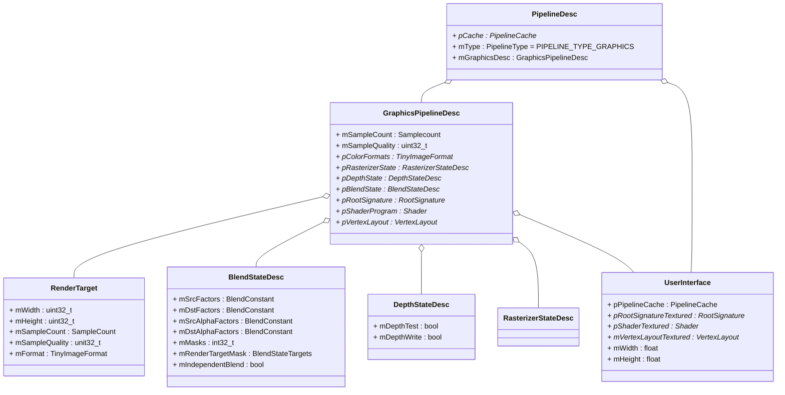
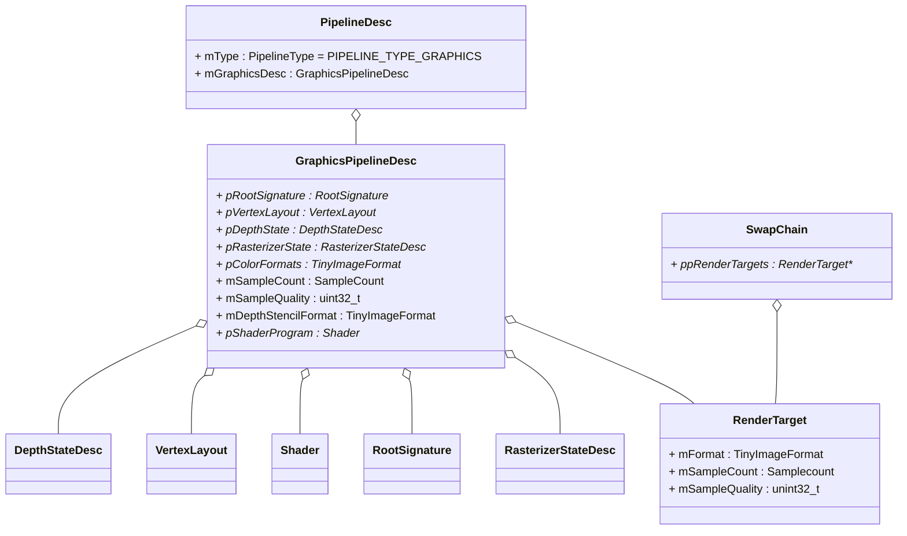

# 独立程序

床啊及独立程序需要执行以下步骤：

1. 从`IApp`接口类派生自定义应用类。`IApp`类定义了程序主入口、创建窗体、初始化绘制信息、更新信息、退出等接口。

2. 使用`DEFINE_APPLICATION_MAIN`宏注册自定义应用类。
   
   ```cpp
   #define DEFINE_APPLICATION_MAIN(appClass)                         \
       int IApp::argc;                                               \
       const char** IApp::argv;                                      \
       extern int WindowsMain(int argc, char** argv, IApp* app);     \
                                                                     \
       int main(int argc, char** argv)                               \
       {                                                             \
           IApp::argc = argc;                                        \
           IApp::argv = (const char**)argv;                          \
           appClass app;                                             \
           return WindowsMain(argc, argv, &app);                     \
       }
   ```
   
   其中`WindowsMain`执行流程精简代码：
   
   ```cpp
   void WindowsMain()
   {
       initMemAlloc(); //初始化内存分配器
       FileSystemInitDesc fs; //定义文件系统对象
       initFileSystem();//初始化文件系统
       fsSetPathForResourceDir(); //设置资源搜索目录
       initLog(); //初始化日志
       initWindowClass();//初始化窗口类
   
       // 更新APP的Setting;
       getMonitor(); //获取监视器设置
   
       //创建并设置窗口定义对象WindowDesc;
       openWindow(); //创建窗口
       initBaseSubsystems(); //初始化子系统
       initTimer(); //初始化计时器
   
       pApp->Init(); //应用程序初始化
       setupAPISwitchingUI(); //安装API切换UI
       :pApp->Load(); //加载App
       while(!quit)
       {
           if (gResetScenario == RESET_SCENARIO_NONE)
           {
               handleMessages(); // 获取消息
               updateBaseSubsystems(); //更新子系统
               pApp->Update();
               pApp->Draw();
           }
           else
           {
               pApp->Unload();
               pApp->Exit();
               exitBaseSubsystems();
           }
       }
       pApp->mSetting.mQuit = true;
       pApp->Unload(); //释放管道、交换链、渲染对象
       pApp->Exit(); //卸载资源、卸载文件系统、输入系统、交互系统
       exitWindowClass(); //退出窗口类
       exitLog(); //退出日志系统
       exitBaseSubsystem(); //退出子系统
       exitFileSystem(); //退出文件系统
       exitMemAlloc(); //退出内存分配器
   }
   ```

# IApp的接口

## Init

该接口用于初始化程序，一般流程如下

```cpp
void Init()
{
    fsSetPathForResourcedir(); //设置资源目录
    构造RenderDesc();
    initRender(); //初始化渲染器
    构造QueueDesc();
    while (ImageCount)
    {
        addCmdPool; //添加命令池
        addCmd; //添加命令
        addFence; //添加栅格器
        addSemaphore; //添加(完成)信号
    }
    addSemaphore; //添加(完成)信号
    initScreenshotInterface; //初始化屏幕快照接口
    initResourceLoaderInterface; //初始化资源读取接口
    addResource(TextrueLoadDesc); //添加资源
    addShader(ShaderLoadDesc); //添加着色器
    addSampler(SamplerDesc); //添加采样器
    addRootSignature(RootSignatureDesc); //添加根签名
    addDescriptorSet(DescriptorSetDesc); //添加解释器集合
    addResource(BufferLoadDesc); //添加资源
    fntDefineFonts(FontDesc); //定义字体
    initFontSystem(FontSystemDesc); //初始化字体系统
    initUserInterface(UserInterfaceDesc); //初始化Forge用户交互
    initProfiler(ProfilerDesc); //初始化分析器和UI
    addGpuProfiler; //添加GPU分析器
    uiCreateComponent(UIComponentDesc); //创建UI组件
    luaRegisterWidget(UIWidget); //注册ui组件，依赖lua
    waitForAllResourceLoads(); //等待所有资源读取
    cameraMotionParameters; //镜头运动参数
    initFpsCameraController(); //初始化镜头控制器
    pCameraController->setMotionParameters(); //设置运动参数
    initInputSystem(InputSystemDesc); //初始化输入系统
    addInputAction(InputActionDesc); //注册输入动作
    updateDescriptorSet(); //更新解释器集合
}
```

## Load

该接口用于添加管道、交换链、深度缓冲区等

```cpp
void Load()
{
    addSwapChain(SwapChainDesc); //添加交换链
    addRenderTarget(RenderTargetDesc); //添加深度缓冲区(貌似不加也可以)
    addFontSystemPipelines(RenderTarget); //添加字体系统管道
    addUserInterfacePipelines(PipelineDesc); //添加用户交互管道
    addPipeline(PipelineDesc); //添加绘制管道
}
```

用户交互管道的组成及基本设置如下:



绘制管道的组成及基本设置如下



## Update

主要用于更新输入系统、场景数据

```cpp
void Update()
{
    updateInputSystem(width, height); //更新输入系统
    pCameraController->update(); //更新镜头控制器
    更新场景();
}
```

## Draw

Draw接口用于实现绘制每帧的内容

```cpp
void Draw()
{
    acquireNextImage(uint32_t); //获取下一帧信息
    getFenceStatus(FenceStatus); //获取Fence
    if (FenceStatus == FENCE_STATUS_INCOMPLETE)
    {
        watiForFences(); //等待GPU完成
    }
    beginUpdateResource(); //开始更新资源
    设置数据映射(); //用户自定义
    endUpdateResource; //结束更新资源
    resetCmdPool(); //重置命令池

    //从这里开始命令
    beginCmd(); //开始命令
    cmdBeginGpuFrameProfile(); //命令-开始Gpu帧的装配
    cmdResourceBarrier(RenderTargetBarrier); //命令-设置资源屏障
    cmdBindRenderTargets(LoadActionDesc); //命令-绑定渲染对象-读取动作说明
    cmdSetViewport(); //命令-设置视口
    cmdSetScissor(); //命令-设置Scissor视角？

    //从这里开始一个对象的绘制流程
    cmdBeginGpuTimestampQuery(); //命令-开始Gpu时间戳查询
    cmdSetViewport(); //命令-设置视口
    cmdBindPipeline(); //命令-绑定管道
    cmdBindDescriptorSet(); //命令-绑定声明集合
    cmdBindVertexBuffer(); //命令-绑定顶点集合
    cmdDraw(); //命令-绘制
    cmdSetViewport(); //命令-设置视口
    cmdEndGpuTimestampQuery(); //命令-结束Gpu时间戳查询
    //绘制对象的流程结束

    endcmd(); //结束命令
    //到这里结束命令

    queueSubmit(QueueSubmitDesc); //队列提交
    queuePresent(QueuePresentDesc); //队列发布
}
```

## Unload

释放管道、交换链、渲染对象

```cpp
void Unload()
{
    waitQueueIdle(); //等待队列闲置
    removeUserInterfacePipelines(); //移除用户交互管道
    removeFontSystemPipelines(); //移除字体系统管道
    removePipeline(); //移除指定管道
    removeSwapChain(); //移除交换链
    removeRenderTarget(); //移除渲染对象
}
```

## Exit

卸载资源、卸载文件系统、输入系统、交互系统

```cpp
void Exit()
{
    exitInputSytem(); //退出输入系统
    exitCameraController(); //退出摄像机控制器
    exitUserInterface(); //退出用户交互
    exitFontSystem(); //退出字体系统
    removeResource(); //移除资源
    removeDescriptorSet(); //移除Descriptor
    removeSampler(); //移除采样器
    removeShader(); //移除着色器
    removeRootSignature(); //移除根信签名
    removeFence(); //移除Fence
    removeSemaphore(); //移除信标
    removeCmd(); //移除命令
    exitResourceLoadrInterface(); //移除资源读取接口
    exitRender(); //移除渲染器
}
```

# 
